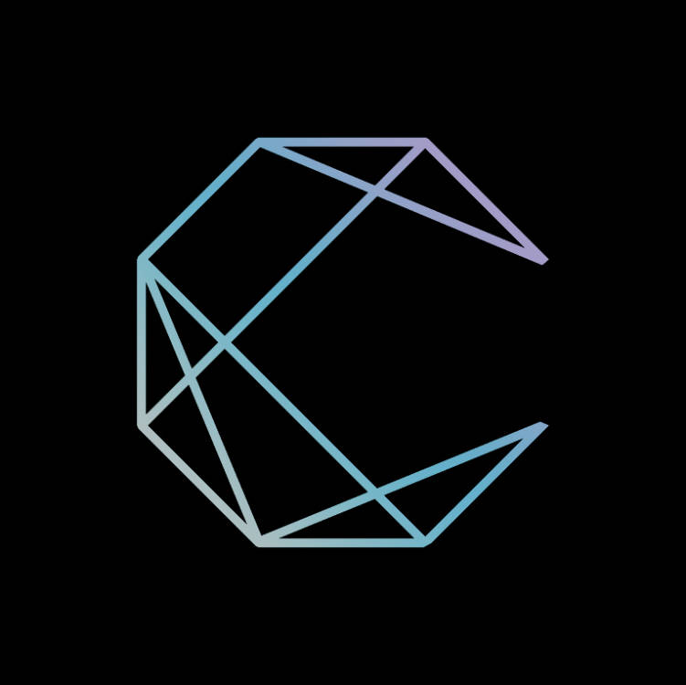

<h1 align="center">
  ChienDice
</h1>

简系

## 📘 Introduction

一个新的骰系

## 🚀 Features

- 🎪 **Interactive [docs](https://iamai.retrofor.space) &amp; [demos](https://iamai.retrofor.space/demos)**
- 🕶 **Seamless migration**: Works for **both** [Rasa]() and [GPT]() and more...
- ⚡ **Fully tree shakeable**: Only take what you want, [bundle size](https://iamai.retrofor.space/export-size)
- 🔩 **Flexible**: Configurable event filters and targets
- 🔌 **Optional [Add-ons](https://iamai.retrofor.space/add-ons)**: [Apscheduler](https://iamai.retrofor.space/add-ons/apscheduler), etc.
- 👍 **Cross-platform**: [cqhttp](https://iamai.retrofor.space/guide/cqhttp-adapter.html), [dingtalk](https://iamai.retrofor.space/guide/dingtalk-adapter.html), [Mirai](https://iamai.retrofor.space/guide/mirai-adapter.html) etc.

## ⬇️ Install

### Docker

通过Docker直接部署。

### pip

通过pip下载后导入包部署

### Raw

下载源码直接部署。

## 🌈Site Preview

### 📌tutorial

- <https://chien.retrofor.space/> _(recommend)_
- <https://chien-dice.vercel.app/>

### 📌tools

- <https://play.chien.retrofor.space/>
- <https://envshare.chien.retrofor.space/>
- <https://flexirobo.retrofor.space/>
- <https://cyberdynamix.retrofor.space/>
  